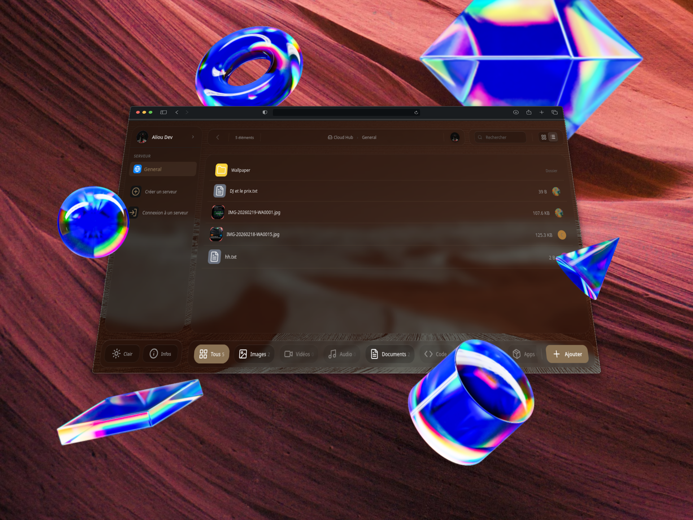
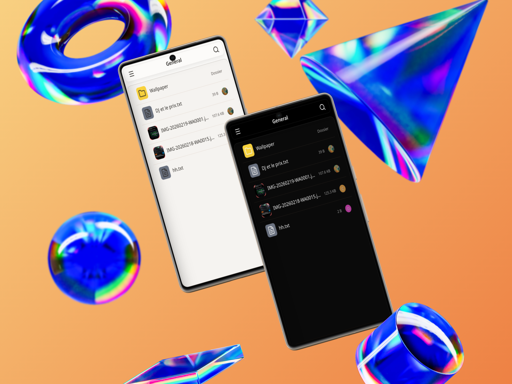
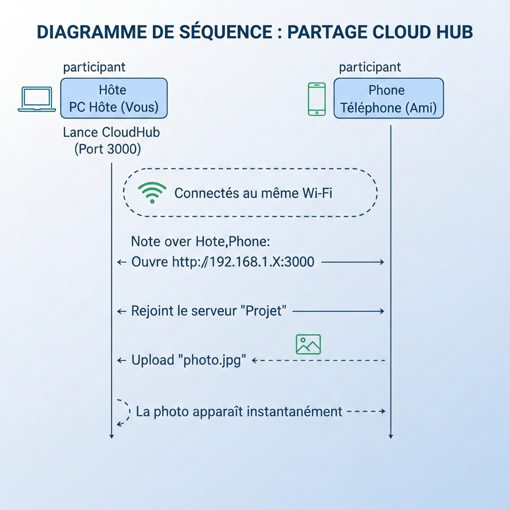
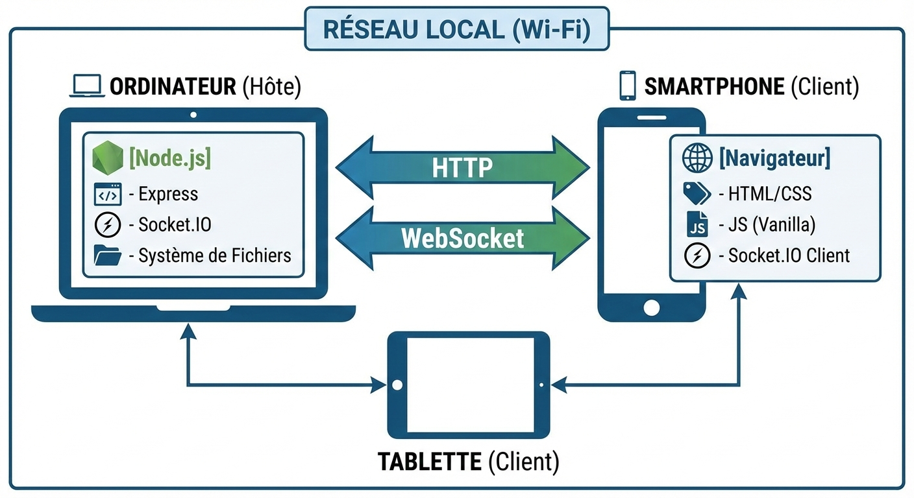

## L'histoire

C'est un soir de partiel. Vous êtes en groupe de révision. Vous devez partager des cours, des TD, des annales. Et là, c'est la galère habituelle qui commence.

Les clés USB passent de main en main. Celle de Martin est pleine de virus. Celle de Sarah est formatée en FAT32 et refuse ce fichier vidéo de 4 Go. Celle de Lucas... il l'a oubliée chez lui.

Les câbles alors ? "J'ai un câble USB-C !" "Ah non, moi c'est du micro-USB." "C'est quoi ce port bizarre ?" On finit toujours par retourner son sac pour trouver le bon adaptateur.

Google Drive ? "Attends, je te partage ça." "Mince, le réseau capte mal ici.", "Ton Drive est plein, ça ne synchronise plus..."

---

### Et si on faisait autrement ?

Imaginez : vous êtes au travail. Vous avez un PDF sur votre PC portable, mais la réunion commence et vous n'avez que votre téléphone. Pas de câble. Le Bluetooth de votre pc fait des siennes. Le fichier est trop lourd pour un mail. Vous perdez 10 minutes à retourner à votre bureau.

Ou alors, vous êtes chez un ami. Vous voulez imprimer une photo prise avec votre téléphone. Pas le bon câble. Pas le même écosystème cloud. Vous finissez par vous l'envoyer à vous-même sur WhatsApp en perdant la qualité de l'image.

En cours, le prof veut distribuer un corrigé à la fin de l'heure. Vous êtes 30. Faire passer une clé USB prendrait 45 minutes. Le temps que la clé arrive au fond de la salle, le prof est déjà parti.

En vacances chez vos parents, vous voulez montrer les photos du voyage sur leur vieil ordinateur de bureau. Votre câble est resté dans la valise. Ils n'ont ni iCloud, ni Google Photos.

**Et si la seule chose nécessaire, c'était le Wi-Fi ?**

Le Wi-Fi est partout. À la fac, au bureau, chez mamie, au café. Tout le monde y est connecté. Pas besoin d'internet. Pas besoin d'inscription. Pas de limite de stockage autre que votre disque dur.

**CloudHub** est né de ces frustrations. Un soir où je voulais juste envoyer un fichier de mon téléphone vers un ordinateur, sans câble et sans passer par le cloud. Je me suis dit : "Ça devrait être simple". Une personne lance le serveur. Les autres se connectent, et hop.

C'est tout.

---

## C'est quoi ?

CloudHub est un petit serveur de fichiers qui tourne sur votre ordinateur. Il devient instantanément accessible depuis n'importe quel appareil connecté au même réseau Wi-Fi — téléphone, tablette, ou un autre ordinateur.

Il n'y a **aucune application à installer** sur les téléphones. Pas de compte à créer. Tout se passe dans le navigateur web.

Vos fichiers ne quittent jamais votre réseau local. Ils ne partent pas sur des serveurs inconnus. Ils restent chez vous, en sécurité.

---

## Captures d'écran

Voici à quoi ressemble CloudHub en action :

| | | |
|:---:|:---:|:---:|
|  |  |  |

---

## Fonctionnalités

### ⚡ Temps réel
Quand quelqu'un dépose un fichier, il apparaît instantanément sur l'écran de tout le monde. Pas besoin d'actualiser la page (F5). La liste se met à jour toute seule, de manière fluide.

### 🔒 Serveurs privés
Besoin de confidentialité ? Créez votre propre "salle". Protégez-la avec un mot de passe. Seuls ceux qui ont le code pourront voir et télécharger les fichiers.

### 🌍 Zone "Général" ouverte
Par défaut, un espace public est toujours accessible. Idéal pour partager un fichier rapidement avec quelqu'un sans configurer de mot de passe. Juste le Wi-Fi, et c'est parti.

### 📱 Multi-supports
PC, Mac, Linux, Android, iPhone, iPad... Peu importe. Tant que l'appareil a un navigateur web récent, ça fonctionne. Fini la guerre iOS vs Android.

### 🖼️ Aperçus automatiques
Les images sont automatiquement redimensionnées pour l'affichage. Vous voyez immédiatement ce que vous téléchargez, sans devoir charger une photo de 10 Mo juste pour voir la miniature.

### 📝 Lecture directe
Les fichiers textes (.txt) s'ouvrent directement dans le navigateur. Pratique pour lire une note ou un bout de code rapidement.

### 📂 Organisation simple
Rangez vos fichiers dans des dossiers, comme sur un vrai ordinateur.

### 🖱️ Glisser-déposer
Glissez vos fichiers depuis votre bureau directement dans la page web pour les envoyer. C'est intuitif.

### 👤 Profils personnalisés
Choisissez un pseudo et un avatar. On sait tout de suite qui a envoyé quoi et qui est connecté dans la salle.

### 🌗 Mode Sombre / Clair
L'interface s'adapte à vos préférences ou au réglage de votre système.

---

## Comment ça marche ?

### Le principe est simple

1.  **L'hôte** (celui qui a les fichiers ou l'ordinateur principal) lance CloudHub.
2.  **Les invités** se connectent au même Wi-Fi.
3.  Ils ouvrent l'adresse (ex: `http://192.168.1.15:3000`) dans leur navigateur.
4.  Tout le monde échange des fichiers.

C'est tout. Pas de configuration complexe, pas d'ouverture de ports sur la box internet.

### Ce qu'il vous faut

*   Un ordinateur pour lancer l'application (l'hôte).
*   Un réseau Wi-Fi (box internet, partage de connexion, routeur de la fac...).
*   [Node.js](https://nodejs.org/) installé sur l'ordinateur hôte.

### Le scénario type



---

## Architecture technique

Voici comment CloudHub fonctionne sous le capot :



### Côté Serveur (Back-end)

| Technologie | Usage |
| :--- | :--- |
| **Node.js** | Le moteur qui fait tourner l'application. |
| **Express** | Serveur web pour distribuer les pages et les fichiers. |
| **Socket.IO** | La magie du temps réel (voir les uploads en direct). |
| **Multer** | Gestion de l'upload des fichiers. |
| **Sharp** | Traitement d'images (création des miniatures légères). |
| **Bonjour/mDNS** | Aide à découvrir le service sur le réseau local. |
| **EJS** | Génération des pages HTML. |

### Côté Client (Front-end)

| Technologie | Usage |
| :--- | :--- |
| **HTML5 / CSS3** | Structure et design (Flexbox, Grid, Variables CSS). |
| **JavaScript Vanilla** | Logique de l'interface (léger, sans gros framework type React). |
| **Socket.IO Client** | Pour discuter en direct avec le serveur. |

### Stockage des données

Tout est stocké **localement** sur l'ordinateur qui lance l'application :

*   `app/uploads/` : Les fichiers reçus (organisés par serveur).
*   `app/data/rooms.json` : La configuration des salles et la liste des fichiers.
*   `app/data/users.json` : Les profils des utilisateurs.
*   `app/config.json` : Les réglages de base (port, nom de l'espace).

---

## Installation

### 1. Prérequis

Il vous faut Node.js (version 16 ou supérieure). Vérifiez s'il est installé :

```bash
node --version
```

Si rien ne s'affiche, téléchargez-le sur [nodejs.org](https://nodejs.org).

### 2. Installation des dépendances

Ouvrez un terminal dans le dossier du projet :

```bash
cd app
npm install
```

### 3. Premier démarrage

Lancez le script de configuration interactif :

```bash
node setup.js
```

Laissez-vous guider :
1.  Le script installe ce qui manque.
2.  Il vous demande le port (3000 par défaut) et le nom de votre espace.
3.  Il démarre le serveur.

### 4. Accéder à CloudHub

Une fois lancé, le terminal vous donne deux adresses :

*   **Accès Local** : `http://localhost:3000` (pour vous).
*   **Accès Réseau** : `http://192.168.1.X:3000` (l'adresse à donner à vos amis).

**Important** : Vos amis doivent être connectés sur le **même réseau Wi-Fi** que vous.

---

## Guide d'utilisation

### Créer son profil
La première fois, on vous demande un pseudo. Vous pouvez ajouter un avatar (depuis votre téléphone ou ordinateur) et choisir votre thème (sombre/clair). C'est ce pseudo que les autres verront.

### Rejoindre le "Général"
C'est la salle par défaut. Ouverte à tous, sans mot de passe. Idéale pour les échanges rapides.

### Créer un serveur privé
Vous voulez de l'intimité ?
1.  Cliquez sur **"Créer un serveur"**.
2.  Donnez-lui un nom, une couleur et une icône.
3.  Définissez un mot de passe solide.
4.  C'est prêt ! Seuls ceux qui ont le mot de passe peuvent entrer.

### Envoyer des fichiers
*   **Glisser-déposer :** Prenez vos fichiers et lâchez-les dans la fenêtre.
*   **Le bouton "+" :** Cliquez sur le bouton flottant > "Uploader un fichier".

### Gérer les dossiers et notes
*   **Dossiers :** Bouton "+" > "Créer un dossier" pour organiser vos fichiers.
*   **Notes rapides :** Bouton "+" > "Texte rapide". Pratique pour partager une URL ou un bout de texte sans créer un fichier .txt manuellement.

### Suppression
Vous pouvez supprimer un fichier si c'est vous qui l'avez envoyé, ou si vous êtes le créateur de la salle (admin).

## Acheter le code

Vous êtes intéressés par ce projet ? Vous pouvez l'acquérir pour l'utiliser dans votre espace de travail, consulter le code source et le personnaliser selon vos besoins.

**Tarif : 65 000 F CFA** (soit environ 99 EUR)

### Ce qui est inclus

- Code source complet (Node.js + Express + Socket.IO)
- Interface frontend (HTML/CSS/JS vanilla)
- Script d'installation interactif
- Documentation technique
- Mises à jour mineures

### Comment acheter ?

Cliquez sur le lien ci-dessous pour me contacter directement via WhatsApp :

**[Contacter pour l'achat →](https://wa.me/221783303378?text=Bonjour%2C%20je%20suis%20int%C3%A9ress%C3%A9%20par%20le%20projet%20CloudHub%20et%20je%20souhaite%20l%27acheter%20au%20tarif%20de%2065%20000%20FCFA.%20Quelle%20est%20la%20proc%C3%A9dure%20%C3%A0%20suivre%20%3F)**

Je vous répondrai sous 24 heures. Paiement accepté par PayPal ou Mobile Money (Wave, Orange).
